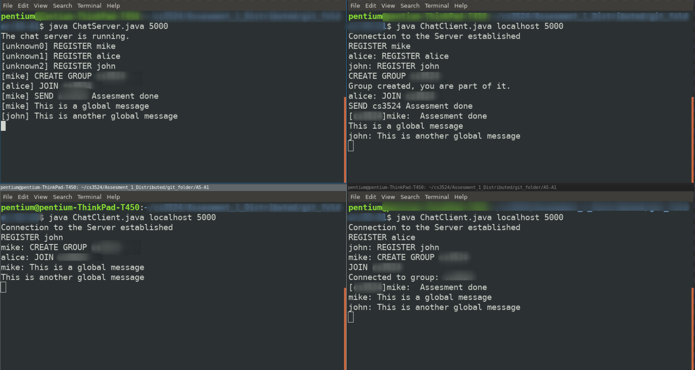

Introduction
============
Remember to place the java files in the right folders. The code has been run on localhost.
It works on the local network but I have not conduced tests in this scenario.
The server commands and the user messages are transmitted trough the same channel. This means
that the server parses all the messages. Good enough for a proof of concept.

How to run the code
===================

In order to start the server on port 5000:

    java ChatServer.java 5000

In order to connect a client on the server on localhost on port 5000:

    java ChatClient.java localhost 5000

How to use the chat
===================

After the connection has been established. The client can see what
public messages are beeing sent by other users but can send a message
only after he has registered with the command REGISTER name. After this
the user can use any commands from the below list in order to interact
with other users and the server.

Commands implemented list
=========================

    {User Registration}
    REGISTER <name>
    UNREGISTER

    {Group management}
    CREATE GROUP <group>
    JOIN <group>
    SEND <group>/<user_name> message
    LEAVE <group>
    REMOVE <group>

    {Topic Management}
    TOPIC <keyword>
    TOPICS
    SUBSCRIBE <keyword>
    UNSUBSCRIBE <keyword>

Server behaviour
=======================

If a client closes the connection with CTRL+C then the server sends to
its stdout that A client has closed the connection. And that the
connection client record will be deleted from groups, topics and the
name,connection HashMaps.

Client behaviour
=======================

The client sends a message to the Server, if the message contains commands
then the server resposnds acordingly. If no commands have been given
then the message is relayed to all other clients. If the client is part
of group and receives a message from another member of that group then
the message has the group name in front of it. If a client wants to send
a message to a group but he is not part of it then the client is
informed that he first has to JOIN the group. If a client SUBSCRIBES to
a topic then he is informed of any message sent on the server that
contains that message. If the user sends a message to another client
then that message is showed only to that client excepting the case where
someone is subscribed to a topic that is part of the message. Privacy violation?
Not a bug, it is a feature.

